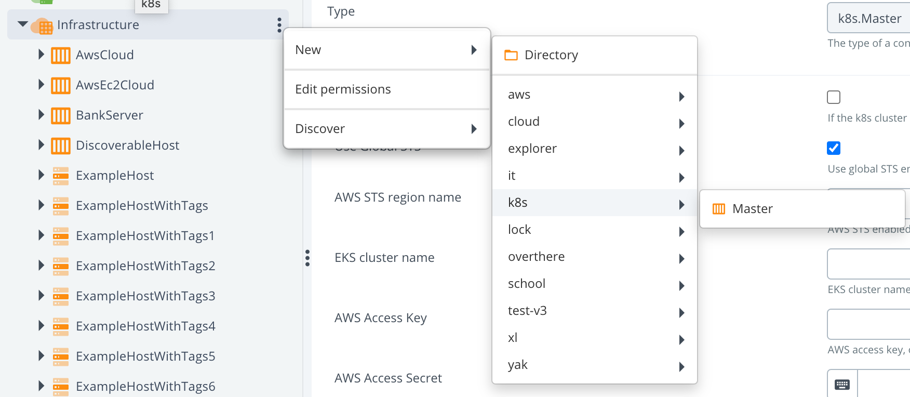
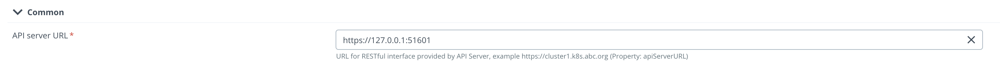
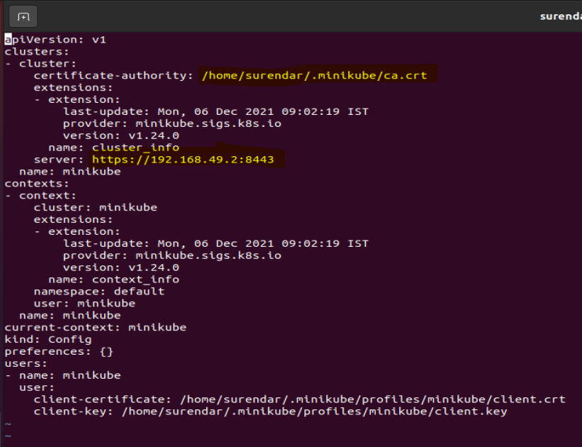
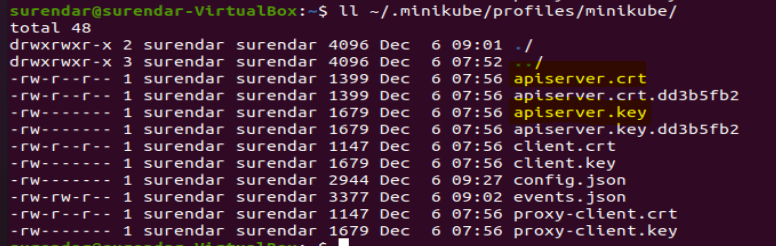
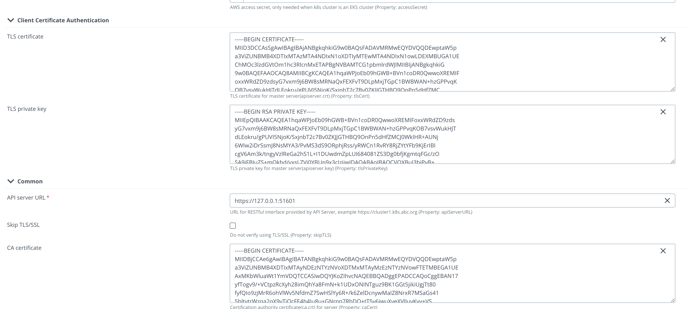
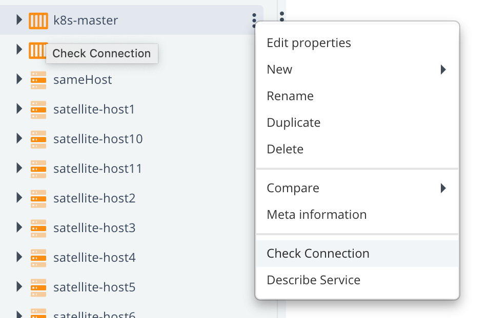
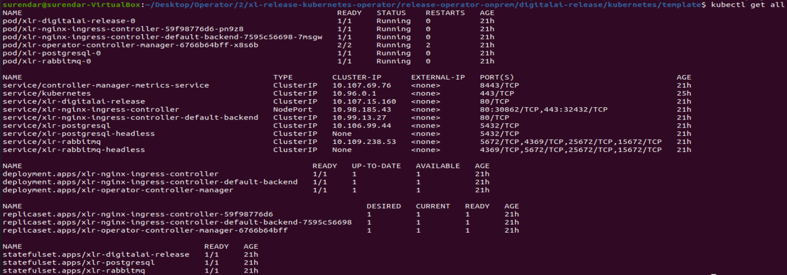
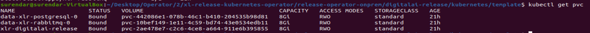

# On Premises

Here you will find a recipe of manual actions how to set up k8s cluster for Release locally with help of an operator.
This document will describe how to do it on `minikube`. If you use another tool, you might need to do it a bit differently.

Prerequisites:
1. minikube
   https://minikube.sigs.k8s.io/docs/start/
2. kubectl
   https://kubernetes.io/docs/tasks/tools/install-kubectl-linux/


If you already had installed minikube as docker based, first you might have to clean it up with:
```shell script
minikube stop; minikube delete 
docker stop $(docker ps -aq) 
rm -rf ~/.kube ~/.minikube 
sudo rm -rf /usr/local/bin/localkube /usr/local/bin/minikube
sudo rm -rf /etc/kubernetes/ 
docker system prune -af --volumes
```

Example:
Based on the resource you have you can update the memory and cpus config.
```shell script
minikube start --cpus=4 --memory=10240MB --kubernetes-version=v1.20.0
```
for compatability make sure, kebernetes version and kubectl version are same.

Execute the below command to check version
```shell script
kubectl version
```
output will be like
```text
Client Version: version.Info{Major:"1", Minor:"20", GitVersion:"v1.20.0", GitCommit:"af46c47ce925f4c4ad5cc8d1fca46c7b77d13b38", GitTreeState:"clean", BuildDate:"2020-12-08T17:59:43Z", GoVersion:"go1.15.5", Compiler:"gc", Platform:"linux/amd64"}
Server Version: version.Info{Major:"1", Minor:"20", GitVersion:"v1.20.0", GitCommit:"af46c47ce925f4c4ad5cc8d1fca46c7b77d13b38", GitTreeState:"clean", BuildDate:"2020-12-08T17:51:19Z", GoVersion:"go1.15.5", Compiler:"gc", Platform:"linux/amd64"}
```

We will need Ingress, so we have to install addons to enable it, as it doesn't come with a default setup:
```shell script
minikube addons enable ingress -p k120
minikube addons enable ingress-dns -p k120
```
```text
Add the ip and host in /etc/hosts with the hostname provided in the dairelease_cr.yaml
To find the ip check with `minikube ip`
```

* Go through the process of [scaffolding](pics/scaffolding.md).
* Create some folder where you can copy and configure the setup. For example `xlr-operator-setup`.
* Copy `config` folder to `xlr-operator-setup`. You need only the next 11 files, the rest you can remove:

|Name|Path|
| :---: | :---: |
|cluster-role-digital-proxy-role.yaml|config/rbac/auth_proxy_role.yaml|
|cluster-role-manager-role.yaml|config/rbac/role.yaml|
|cluster-role-metrics-reader.yaml|config/rbac/auth_proxy_client_clusterrole.yaml|
|controller-manager-metrics-service.yaml|config/rbac/auth_proxy_service.yaml|
|custom-resource-definition.yaml|config/crd/bases/xld.my.domain_xldeployhelmcharts.yaml|
|deployment.yaml|config/default/manager_auth_proxy_patch.yaml|
|leader-election-role.yaml|config/rbac/leader_election_role.yaml|
|leader-election-rolebinding.yaml|config/rbac/leader_election_role_binding.yaml|
|manager-rolebinding.yaml|config/rbac/role_binding.yaml|
|proxy-rolebinding.yaml|config/rbac/auth_proxy_role_binding.yaml|
|dairelease_cr.yaml|config/samples/xld_v1alpha1_digitalairelease.yaml|

That mapping has to be applied in `applications.yaml` file. There you can find 10 references to a file, which initially points to a template (paths needs to be relative). Example:

`file: !file "kubernetes/template/manager-rolebinding.yaml"`

- Next step is to configure locally Deploy. Make sure, that you have installed Kubernetes plugin.
- First we will manually create infrastructure CI in Deploy to make sure, that provided values are working against a local
  cluster. I will describe how to do it for a `minikube`, so if you are using something else, some technical details can
  be a bit different, but the idea is the same.
    - Start creating CI with type k8s.Master 
    - Fill in `API server URL` field:
      
      To find your server API and Ca cert:
      view ~/.kube/config
      
    - Next 3 fields are regarding the certifications. Therefore we have first to find the place where they are located. As
      it depends on which profile is activated. Check it with a command `minikube profile`. For example for me, the active profile
      is `minikube`, and my certificates are located at:

```text
ll cd ~/.minikube/profiles/minikube 
check for apiserver.crt, apiserver.key
```


Knowing all this information, we can fill in next fields:

|Field name|Path to the cert|
| :---: | :---: |
|caCert|~/.minikube/ca.crt|
|tlsCert|~/.minikube/profiles/minikube/apiserver.crt|
|tlsPrivateKey|~/.minikube/profiles/minikube/apiserver.key|

:::tip

You have to provide in the field not a path, but a content.  
Example: 

:::

After that we have to verify if the provided configuration is correct, and we can connect to the cluster. For that
we will use a control task "Check Connection".


If everything configured correctly, you should see something like this:


- After this success we are ready to fill in the next Yaml file `infrastructure.yaml`
  Fill in here these 4 fields: `apiServerURL`, `caCert`, `tlsCert` and `tlsPrivateKey`.

- Next step is to verify that no mistakes happened during copy-pasting to `infrastructure.yaml`. For that we need to use
  [As Code](https://docs.xebialabs.com/v.10.2/deploy/concept/get-started-with-devops-as-code/) feature
  of Deploy to create CIs with help of [XL CLI](https://docs.xebialabs.com/v.10.2/deploy/how-to/install-the-xl-cli/).
  Please check [XL CLI](https://docs.xebialabs.com/v.10.2/deploy/how-to/install-the-xl-cli/) how to install it.
  Run `xl apply -f infrastructure.yaml` by being in the same directory, or specify the full path to the file. In case you
  have non-default URL, you have to add this parameter: `--xl-deploy-url YOUR_XL_DEPLOY_URL`

- Next thing to tailor few parameters on the file `dairelease_cr.yaml`. Copy xlr_v1alpha1_digitalairelease.yaml from scaffolding folder (you can find it in `config/samples` folder) to `xl-release-kubernetes-operator/release-operator-onprem/digitalai-release/kubernetes/` folder.
    - Define or comment  `KeystorePassphrase` and `RepositoryKeystore`
    - Change StorageClass to what you have. For example, you can use 'standard', in case of using local file system.
      It depends [how you configured it](https://xebialabs.github.io/xl-deploy-kubernetes-helm-chart/docs/installing-storage-class).
    - Define your license in `xlrLicense` field, by converting `xl-release-license.lic` file's content to base64.
    - Define `RepositoryKeystore` as `zs7OzgAAAAIAAAABAAAAAwAWZGVwbG95aXQtcGFzc3N3b3JkLWtleQAAAX0FGMZRrO0ABXNyADNjb20uc3VuLmNyeXB0by5wcm92aWRlci5TZWFsZWRPYmplY3RGb3JLZXlQcm90ZWN0b3LNV8pZ5zC7UwIAAHhyABlqYXZheC5jcnlwdG8uU2VhbGVkT2JqZWN0PjY9psO3VHACAARbAA1lbmNvZGVkUGFyYW1zdAACW0JbABBlbmNyeXB0ZWRDb250ZW50cQB+AAJMAAlwYXJhbXNBbGd0ABJMamF2YS9sYW5nL1N0cmluZztMAAdzZWFsQWxncQB+AAN4cHVyAAJbQqzzF/gGCFTgAgAAeHAAAAARMA8ECHAyz3pefALRAgMDDUB1cQB+AAUAAACQb6Y2JUQqkd5PtdwIAKEWNiVMcTnIS85U7FsvOb+b+xfOCV8+disezZCQ2f4F6YVGRO++u+NXd0YNDn/eXwge4w7i4ewNBydpMSTpVJieJA3nhh7mvUktatsAV+H7EcGYeMPx/cAlkqyFUHuiGz9p1ft3pxmxey2Uyt/FiBgAiV2hZAj14vGdSoRsMH8qN5ECdAAWUEJFV2l0aE1ENUFuZFRyaXBsZURFU3QAFlBCRVdpdGhNRDVBbmRUcmlwbGVERVO9rqwVmysM6czWLFdUj1+Xh1hxHQ==`. (It's a working dummy example, you are free to use what you wish)
    - Define `KeystorePassphrase` as `deployit`. (It's a working dummy example, you are free to use what you wish)
    - Change namespaces in all yaml files to "default", instead of "system"
    - Change for all `kind: ServiceAccount` the name to `default`.
    - Replace the content of `manager_auth_proxy_patch.yaml` to:
```yaml
apiVersion: apps/v1
kind: Deployment
metadata:
  labels:
    control-plane: controller-manager
  name: xlr-operator-controller-manager
spec:
  replicas: 1
  selector:
    matchLabels:
      control-plane: controller-manager
  template:
    metadata:
      labels:
        control-plane: controller-manager
    spec:
      containers:
        - name: kube-rbac-proxy
          image: gcr.io/kubebuilder/kube-rbac-proxy:v0.8.0
          args:
            - "--secure-listen-address=0.0.0.0:8443"
            - "--upstream=http://127.0.0.1:8080/"
            - "--logtostderr=true"
            - "--v=10"
          ports:
            - containerPort: 8443
              name: https
        - name: manager
          args:
            - "--health-probe-bind-address=:8081"
            - "--metrics-bind-address=127.0.0.1:8080"
            - "--leader-elect"
            - "--leader-election-id=xld-operator-controller-manager"
          image: xebialabs/xlr-operator:1.0.0
          livenessProbe:
            httpGet:
              path: /readyz
              port: 8081
            initialDelaySeconds: 15
            periodSeconds: 20
          readinessProbe:
            httpGet:
              path: /healthz
              port: 8081
            initialDelaySeconds: 5
            periodSeconds: 10
          resources:
            limits:
              cpu: 100m
              memory: 90Mi
            requests:
              cpu: 100m
              memory: 60Mi
      terminationGracePeriodSeconds: 10
```

- Now you are ready to run the complete configuration with:
  `xl apply -v -f digital-ai.yaml`

## Troubleshooting

###After successful deployment you can check the pod instances
```kubectl get all```
The output should show the running pods with ready state


If pods are getting restarted check pvc status. If all are in bound state, then mostly because of resource constraint.
```text
kubectl get pvc
```


To avoid the resource constraint, check the following options
1. Increase the memory and cpu resources while starting the minikube
2. Reduce the number of replica set for operator instance, rabbitmq and for other resources.

To check the logs of the pods
```text
kubctl logs --follow <pod name>
```

## Uninstall

* Perform undeploy of operator in Deploy
* Remove manually all other CIs left in Deploy
* Clean PVCs manually