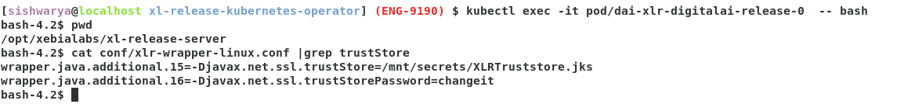

# Adding truststore files

## Prerequisites

- Linux environment
- The kubectl command-line tool
- The yq command-line tool ([Use the latest binary](https://github.com/mikefarah/yq/releases))
- Access to a Kubernetes cluster with installed Release

## Adding truststore file generic example for Release.
* Add certificate to truststore (XLRTruststore.jks)
  * ```shell
     keytool -import -alias exampleCert -file exampleCert.cer -keystore XLRTruststore.jks
     ```
* Create secret yaml "xlr-trust-store_secret.yaml"
  * ```yaml
     apiVersion: v1
     kind: Secret
     metadata:
     name: xlr-secret-store
     namespace: default
     data:
       XLRTruststore.jks: "<base 64 from previous command here 'cat XLRTruststore.jks | base64'>"       
    ```
  * ```shell
     kubectl apply -f xlr-trust-store_secret.yaml
     ```
* By editing STS, create volumemount and volumes for the created secret in above step.
  ```shell
     kubectl get statefulset.apps/dai-xlr-digitalai-release -o yaml > release.yaml
     ```
  * update the volume mount and volume for secret.
    * volume mount
      ```yaml
          volumeMounts:
          - mountPath: /mnt/secrets
             name: xlr-secret-store-volume
             readOnly: true
      ```
    * volume
      ```yaml
           volumes:
           - name: xlr-secret-store-volume
             secret:
                secretName: xlr-secret-store
                items:
                - key: XLRTruststore.jks
                  path: XLRTruststore.jks
                - key: XLDKeystore.jks
                  path: XLDKeystore.jks
      ```
    * ```shell
        kubectl apply -f release.yaml
        ```

* Update the xlr-wrapper-linux.conf/xlr-wrapper-win.conf as mentioned [in the section](#update-xlr-wrapper-linuxconfxlr-wrapper-winconf-depending-on-your-system)

## Trust an Deploy server's certificate in Release
* If you configured your Deploy server to use a self-signed certificate and then added the server to Release, you will notice that testing the connection fails. with the following error: Can't connect to XL Deploy Server.
* To instruct Release to trust the Deploy server certificate, you must configure a truststore for Release.

## To create a dedicated truststore for Release:

* Export the self-signed server certificate from XL_DEPLOY_SERVER_HOME/conf.
   * keytool -export -keystore XLDKeystore.jks -alias jetty -file XLDeployServerCert.cer

* If Deploy is running in k8s cluster with tls enabled , then get the certificate of ingress.
   * eg: https://xld-operator-test.germanywestcentral.cloudapp.azure.com/
      * Download the certificate from browser and name it as XLDeployServerCert.cer

* Import the certificate, as a trusted certificate, into a separate truststore for Release:
   * ```shell
     keytool -import -alias XLDeployServerCert -file XLDeployServerCert.cer -keystore XLRTruststore.jks
     ```
* Import all certificates from the JRE global truststore:
   * ```shell
        keytool -importkeystore -srckeystore /etc/ssl/certs/java/cacerts \
        -srcstoretype JKS \
        -destkeystore XLDKeystore.jks \
        -deststoretype JKS \
        -srcstorepass changeit \
        -deststorepass changeit     
     ```
* Create secret yaml "xlr-trust-store_secret.yaml"
   * cat XLDKeystore.jks | base64
   * cat XLRTruststore.jsk | base64

   * ```yaml
     apiVersion: v1
     kind: Secret
     metadata:
     name: xlr-secret-store
     namespace: default
     data:
       XLRTruststore.jks: "<base 64 from previous command here 'cat XLRKeystore.jks | base64'>"
       XLDKeystore.jks: "<base 64 from previous command here 'cat XLDTruststore.jsk | base64'>"
     ```
   * ```shell
     kubectl apply -f xlr-trust-store_secret.yaml
     ``` 
   * ```shell
     kubectl get secret xlr-secret-store
     [sishwarya@localhost xl-release-kubernetes-operator] (ENG-9190) $ kubectl get secret xlr-secret-store
      NAME               TYPE     DATA   AGE
      xlr-secret-store   Opaque   2      3h17m
     ```
     
* Create volumemount and volumes for the created secret.
   * 
  
     
   * ```shell
     kubectl get statefulset.apps/dai-xlr-digitalai-release -o yaml > release.yaml
     ```
     * update the volume mount and volume for secret.
         * volume mount
           ```yaml
               volumeMounts:
               - mountPath: /mnt/secrets
                  name: xlr-secret-store-volume
                  readOnly: true
           ```
         * volume 
           ```yaml
                volumes:
                - name: xlr-secret-store-volume
                  secret:
                     secretName: xlr-secret-store
                     items:
                     - key: XLRTruststore.jks
                       path: XLRTruststore.jks
                     - key: XLDKeystore.jks
                       path: XLDKeystore.jks
           ```
         * ```shell
               [sishwarya@localhost xl-release-kubernetes-operator] (ENG-9190) $ kubectl edit statefulset.apps/dai-xlr-digitalai-release
                statefulset.apps/dai-xlr-digitalai-release edited
           ```
   *
   
       
## Update xlr-wrapper-linux.conf/xlr-wrapper-win.conf, depending on your system. 

*  Configure Release to use the truststore.

* Get current xlr-wrapper-linux.conf file from the release server node:
    ```shell
    ❯ kubectl cp dai-xlr-digitalai-release-0:/opt/xebialabs/xl-release-server/conf/xlr-wrapper-linux.conf ./xlr-wrapper-linux.conf
    ```

* Create following template file to append to it the retrieved `./xlr-wrapper-linux.conf`:
    ```shell
    ❯ echo 'apiVersion: v1
    kind: ConfigMap
    metadata:
      name: xl-release-wrapper-config-map
      labels:
        app: digitalai-release
    data:
      xlr-wrapper-linux.conf: |' > config-patch-xl-release-wrapper.yaml.template
    ```

* Merge the files:
    ```shell
    ❯ cat config-patch-xl-release-wrapper.yaml.template > config-patch-xl-release-wrapper.yaml
    ❯ sed -e 's/^/     /' xlr-wrapper-linux.conf >> config-patch-xl-release-wrapper.yaml
    ```

* Change the config in the `config-patch-xl-release-wrapper.yaml`.
    ```text
    Add the following line, where ‘X’ is the next number in the wrapper.java.additional list:
    wrapper.java.additional.X=-Djavax.net.ssl.trustStore=/mnt/secret/XLRTruststore.jks
    wrapper.java.additional.X+1=-Djavax.net.ssl.trustStorePassword=changeit
    ```

* Create the config map with `config-patch-xl-release-wrapper.yaml`:
    ```shell
    ❯ kubectl create -f config-patch-xl-release-wrapper.yaml
    ```

* Get all statefulsets (release statefulset will be suffixed with `-release`):
    ```shell
    ❯ kubectl get sts -o name
    ```

* Change the statefulset for the release server by adding volume mounts and volumes:
    ```shell
    ❯ kubectl get statefulset.apps/dai-xlr-digitalai-release -o yaml \
        | yq eval '.spec.template.spec.containers[0].volumeMounts += {
            "mountPath": "/opt/xebialabs/xl-release-server/conf/xlr-wrapper-linux.conf",
            "name": "xl-release-wrapper-volume",
            "subPath": "xlr-wrapper-linux.conf"
          }' - \
        | yq eval '.spec.template.spec.volumes += [{
            "name": "xl-release-wrapper-volume",
            "configMap": {
              "name": "xl-release-wrapper-config-map"
            }
          }]' - \
        | kubectl replace -f -
    ```
* 

## Update deployit-defaults.properties.
* In order to verify self signed certificates for Release and Deploy, a public certificate of the Deploy Server must be supplied.

* Get current deployit-defaults.properties file from the release server node:
    ```shell
    ❯ kubectl cp dai-xlr-digitalai-release-0:/opt/xebialabs/xl-release-server/conf/deployit-defaults.properties ./deployit-defaults.properties
    ```

* Create following template file to append to it the retrieved `./deployit-defaults.properties`:
    ```shell
    ❯ echo 'apiVersion: v1
    kind: ConfigMap
    metadata:
      name: xlr-default-properties-config-map
      labels:
        app: digitalai-release
    data:
      deployit-defaults.properties: |' > config-patch-xlr-default-properties.yaml.template
    ```

* Merge the files:
    ```shell
    ❯ cat config-patch-xlr-default-properties.yaml.template > config-patch-xlr-default-properties.yaml
    ❯ sed -e 's/^/     /' deployit-defaults.properties >> config-patch-xlr-default-properties.yaml
    ```

* Change the config in the `config-patch-xlr-default-properties.yaml`.
    ```text
    update following line by specifying the location of the public certificate of deploy
    xldeploy.XLDeployServer.verifySSL
    
     For e.g. xldeploy.XLDeployServer.verifySSL=/path/to/the/public/cert/of/Deploy    
    ```

* Create the config map with `config-patch-xlr-default-properties.yaml`:
    ```shell
    ❯ kubectl create -f config-patch-xl-release-conf.yaml
    ```

* Get all statefulsets (release statefulset will be suffixed with `-release`):
    ```shell
    ❯ kubectl get sts -o name
    ```

* Change the statefulset for the release server by adding volume mounts and volumes:
    ```shell
    ❯ kubectl get statefulset.apps/dai-xlr-digitalai-release -o yaml \
    | yq eval '.spec.template.spec.containers[0].volumeMounts += {
        "mountPath": "/opt/xebialabs/xl-release-server/conf/deployit-defaults.properties",
        "name": "xlr-default-properties-volume",
        "subPath": "deployit-defaults.properties"
      }' - \
    | yq eval '.spec.template.spec.volumes += [{
        "name": "xlr-default-properties-volume",
        "configMap": {
          "name": "xlr-default-properties-config-map"
        }
      }]' - \
    | kubectl replace -f -
    ```
* 

* 
